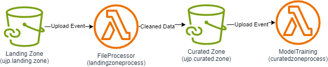
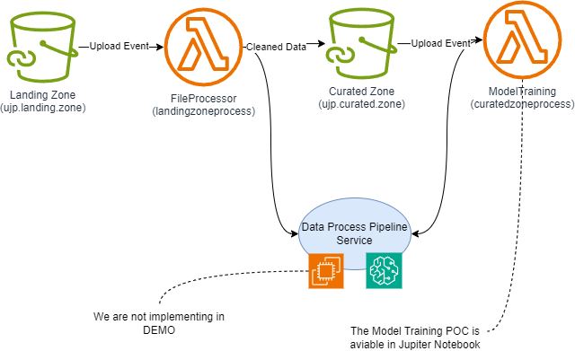

# Architecture

Simple Approach: as per the given instructions.

The lamdba functions are performing data clean up. we are not running the model training routing as these will bloat up the binary footprint of lambda function beyond 250MB limit and we are not using container based functions in this POC.

> NOTE: The model training is supported in jupiter notebook placed in the source.



## Proposed approach

we propose the following change to the architecture.

1. use lambda functions as glue code integrating two aws resources.
2. implement long running processes in containers designed for the purpose. we recommend SageMaker to ML processes and/Or EC2 instance for similar purposes.



> NOTE: the demo implements minimal file processing capability all handled within lambda. ideally lamda should deleget these operations to a long running process running in Sagemaker or service.

Scope: This could be further improved by involving workflow using Step Functions.

## **Limitations**

### Current design

I have limited this poc to not involve container based lamda's this limits to the total slze of a lambda to be below 250MB mark. introducing more libraries like the ML capabilities are challenging. However, since the project requirements did not demand that. we are good. however, just to be aware this would require containers based approach. However, since building such long running processes in lambda is not adviced the Proposed approach is recommended.

### Linear Regression

1. **Linear Assumptions**
   * Linear Regression assumes a linear relationship between features and the target.
   * If your data has  **non-linear patterns** , regression may underperform.
2. **Sensitivity to Outliers**
   * Regression models can be heavily influenced by extreme values, which can distort predictions.
3. **Feature Interactions**
   * Linear models don’t automatically capture interactions between features unless explicitly engineered.
4. **Limited Handling of Complex Data**
   * Regression struggles with high-dimensional or sparse data (e.g., many categorical features).

### Alternatives approaches

| Model                         | Why It Might Be Better                                              |
| ----------------------------- | ------------------------------------------------------------------- |
| **Random Forest**       | Captures non-linear relationships, robust to outliers               |
| **Gradient Boosting**  | High accuracy, handles complex patterns well                        |
| **Neural Networks**     | Good for large datasets with complex feature interactions           |
| **KNN Regression**      | Simple, non-parametric, good for small datasets with local patterns |

> NOTE: we tested with Linear Regression and then switched to Random Forest as it showed improvment however, the data set is too small and includes data ranges that are very large to achieve good performance.	


#### Error observation

```
Mean Squared Error: 7147802.95166467

```

Errors = Target values - predicted values

The observed data spread is

```
mean = 330.7978396969698
max= 5447.601166666664
min = -7881.324999999997
standard deviation = 2715.4256554882772
```


# Build and Deploy Steps:

we have a helper shell script build.sh that will perform the following:

cd src_lambda

```
./build.sh landing --> generates lambda package for landing zone process
./build.sh curated --> generates lambda package for curated zone process

```

Run terraform commands to deploy

cd src_ioc

this assumes you have `aws configure` successfully

```
terraform init
terraform plan
terraform apply
terraform destroy
```

# Test

event parameter to lamdba function.

Fields used:

```
record = event['Records'][0]
bucket_name = record['s3']['bucket']['name']
object_key = record['s3']['object']['key']
```

S3 Put event as below:

```
{
  "Records": [
    {
      "eventVersion": "2.0",
      "eventSource": "aws:s3",
      "awsRegion": "us-east-1",
      "eventTime": "1970-01-01T00:00:00.000Z",
      "eventName": "ObjectCreated:Put",
      "userIdentity": {
        "principalId": "EXAMPLE"
      },
      "requestParameters": {
        "sourceIPAddress": "127.0.0.1"
      },
      "responseElements": {
        "x-amz-request-id": "EXAMPLE123456789",
        "x-amz-id-2": "EXAMPLE123/5678abcdefghijklambdaisawesome/mnopqrstuvwxyzABCDEFGH"
      },
      "s3": {
        "s3SchemaVersion": "1.0",
        "configurationId": "testConfigRule",
        "bucket": {
          "name": "ujp.landing.zone",
          "ownerIdentity": {
            "principalId": "EXAMPLE"
          },
          "arn": "arn:aws:s3:::ujp.landing.zone"
        },
        "object": {
          "key": "sample_data.csv",
          "size": 1024,
          "eTag": "0123456789abcdef0123456789abcdef",
          "sequencer": "0A1B2C3D4E5F678901"
        }
      }
    }
  ]
}
```
