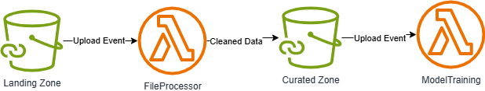

# Architecture

Simple Approach: as per the given instructions.



Scope: This could be further improved by involving workflow using Step Functions.


### **Limitations of Linear Regression**

1. **Linear Assumptions**
   * Linear Regression assumes a linear relationship between features and the target.
   * If your data has  **non-linear patterns** , regression may underperform.
2. **Sensitivity to Outliers**
   * Regression models can be heavily influenced by extreme values, which can distort predictions.
3. **Feature Interactions**
   * Linear models don’t automatically capture interactions between features unless explicitly engineered.
4. **Limited Handling of Complex Data**
   * Regression struggles with high-dimensional or sparse data (e.g., many categorical features).

### **Alternatives (Depending on Context)**

| Model                         | Why It Might Be Better                                              |
| ----------------------------- | ------------------------------------------------------------------- |
| **Random Forest**       | Captures non-linear relationships, robust to outliers               |
| **Gradient Boosting**  | High accuracy, handles complex patterns well                        |
| **Neural Networks**     | Good for large datasets with complex feature interactions           |
| **KNN Regression**      | Simple, non-parametric, good for small datasets with local patterns |


# Build and Deploy Steps:

Zip the lamda files for lamda functions.

```
zip lambda_landingzoneprocess.zip ../src/landingzoneprocess.py
```

Run terraform commands to deploy

this assumes you have `aws configure` successfully 

```
terraform init
terraform plan
terraform apply
terraform destroy
```


```
ms-python.vscode-python-envs
ms-python.debugpy
ms-python.python
ms-python.vscode-pylance
cweijan.vscode-office
```
